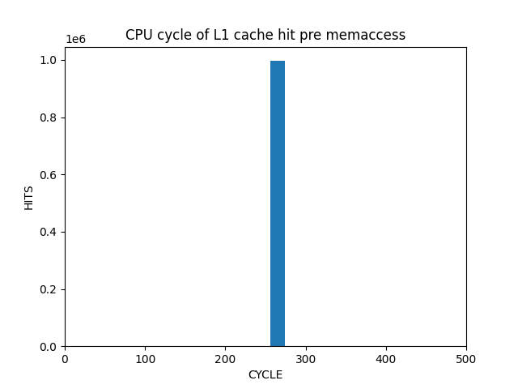
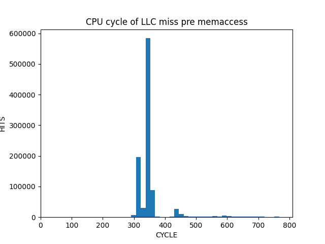
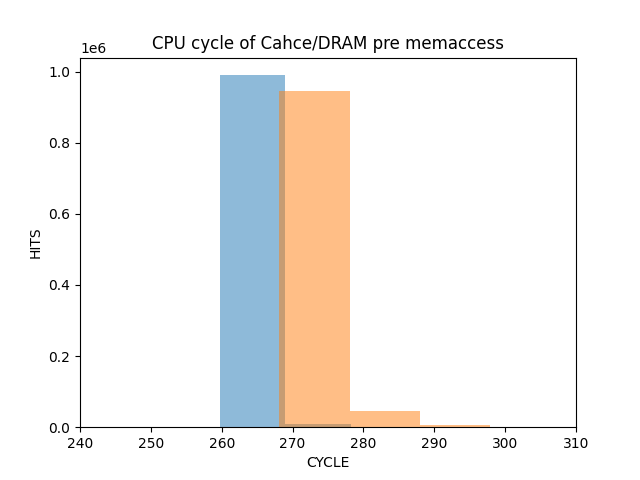

record time and remove outliers

# perf_event
 - can't use in userspace in rpi4b with ubuntu22.04 armv8
 - but can use in supermode with `sudo`

```
L1: timing.h:98: perf_init: Assertion `fd >= 0 && "if this assertion fails you have no perf event interface available for the userspace. install a different kernel/rom."' failed.
```

# L1 hit



# L2 miss



# Threshold


